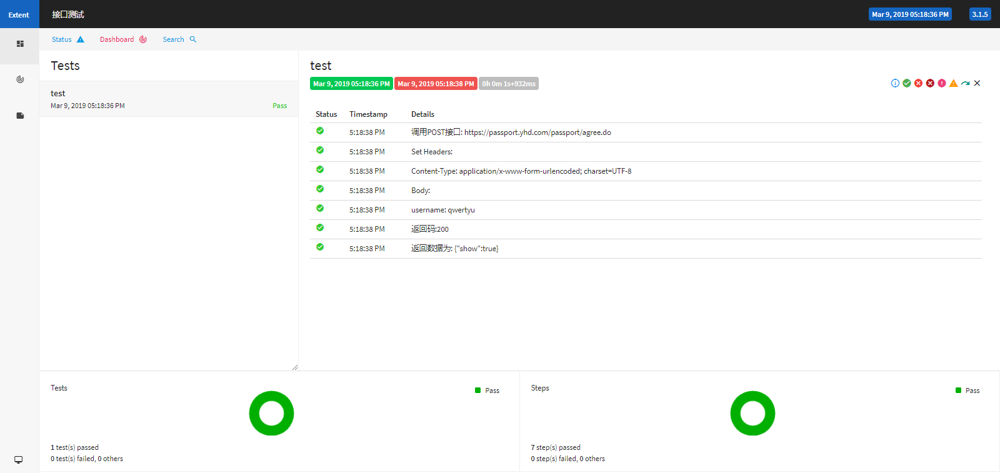

### 框架介绍
1. 对HttpClient结合TestNG、ExtentReport进行封装
3. 能够使用Fiddler进行调试
4. 能够使用代理
5. 对HTTPS请求忽略证书验证
6. 能在Jenkins上运行

### 使用
通过Maven运行：
```
mvn clean
mvn test
```
或：

使用idea，通过右键运行testng.xml。
### 使用方法
```java
//构建header
HashMap<String, String> header = new HashMap<>();
header.put("Content-Type","application/x-www-form-urlencoded; charset=UTF-8");
//构建body
HashMap<String, String> body = new HashMap<>();
body.put("username","qwertyu");
//调用post方法
CloseableHttpResponse response = NetUtils.post("https://passport.yhd.com/passport/agree.do", header, body);
//获取Response Code
NetUtils.getResponseStatusCode(response);
//获取Response 文本
NetUtils.getResponseString(response);
```

### 报告样式

